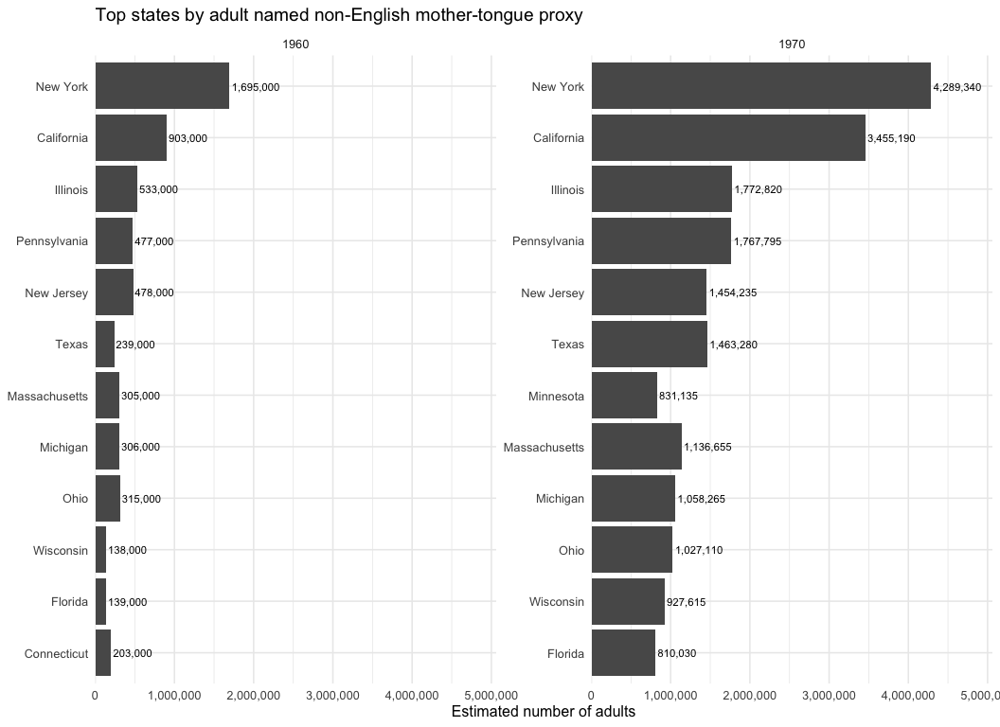

- [Purpose](#purpose)
- [Load Packages and Data](#load-packages-and-data)
- [Labels and Helper Functions](#labels-and-helper-functions)
- [Measurement Notes](#measurement-notes)
- [Sample and Reporting Coverage](#sample-and-reporting-coverage)
- [Adult Non-English Mother Tongue by
  State](#adult-non-english-mother-tongue-by-state)
- [Adult Non-English Mother Tongue by
  Language](#adult-non-english-mother-tongue-by-language)
- [State Shares](#state-shares)
- [Birthplace, Race, and Hispanic
  Origin](#birthplace-race-and-hispanic-origin)
- [Geographic Concentration by
  Language](#geographic-concentration-by-language)
- [Notes for Interpretation](#notes-for-interpretation)
- [Session Information](#session-information)

# Purpose

This notebook analyzes the 1960 and 1970 IPUMS data as a pre-1980
mother-tongue proxy for the adult heritage-language analysis in Nagano
(2015).

The estimates in this notebook should not be merged directly into the
1980-2010 home-language series. The Nagano-style adult heritage-language
definition uses variables that are not available in the same form for
1960 and 1970:

- `LANGUAGE`, the language spoken at home, is not available for these
  years.
- `SPEAKENG`, English speaking ability, is not available in this
  extract.
- `YRIMMIG`, year of immigration, is not available in this extract, so
  age at arrival cannot be used.
- `CONSPUMA` is not available in this extract, so the geographic
  concentration analysis uses states rather than ConsPUMAs.

Instead, this notebook uses `MTONGUE` / `MTONGUED` to identify adults
with a reported non-English mother tongue. This is a proxy for
historical language background, not current home-language use.

# Load Packages and Data

``` r
library(dplyr)
library(forcats)
library(ggplot2)
library(haven)
library(knitr)
library(readr)
library(scales)
library(stringr)
library(tidyr)
```

``` r
data_dir <- "data"
data_files <- list.files(data_dir, pattern = "^usa_.*[.]sav$", full.names = TRUE)
data_files <- data_files[file.info(data_files)$size > 0]
data_files <- data_files[order(readr::parse_number(basename(data_files)))]

if (length(data_files) == 0) {
  stop("No non-empty IPUMS .sav files matching data/usa_*.sav were found.")
}

basename(data_files)
```

    ## [1] "usa_00119.sav"

Only variables used in this notebook are loaded.

``` r
vars_needed <- c(
  "YEAR", "SAMPLE", "STATEFIP", "PERWT", "AGE", "BPL",
  "MTONGUE", "MTONGUED", "RACESING", "HISPAN"
)

read_ipums_file <- function(path) {
  message("Reading ", basename(path))
  haven::read_sav(path, col_select = any_of(vars_needed)) |>
    mutate(source_file = basename(path))
}

raw <- data_files |>
  lapply(read_ipums_file) |>
  bind_rows() |>
  filter(YEAR %in% c(1960, 1970))

glimpse(raw)
```

    ## Rows: 382,401
    ## Columns: 11
    ## $ YEAR        <dbl+lbl> 1960, 1960, 1960, 1960, 1960, 1960, 1960, 1960, 1960, …
    ## $ SAMPLE      <dbl+lbl> 196002, 196002, 196002, 196002, 196002, 196002, 196002…
    ## $ STATEFIP    <dbl+lbl> 1, 1, 1, 1, 1, 1, 1, 1, 1, 1, 1, 1, 1, 1, 1, 1, 1, 1, …
    ## $ PERWT       <dbl> 1000, 1000, 1000, 1000, 1000, 1000, 1000, 1000, 1000, 1000…
    ## $ AGE         <dbl+lbl> 40, 37, 24, 24,  3,  1, 35, 34,  9,  5, 53, 41, 34,  6…
    ## $ HISPAN      <dbl+lbl> 0, 0, 0, 0, 0, 0, 0, 0, 0, 0, 0, 0, 0, 0, 0, 0, 0, 0, …
    ## $ BPL         <dbl+lbl>   1,   1,   1,   1,   1,   1, 410, 433, 499, 410, 410,…
    ## $ MTONGUE     <dbl+lbl>  0,  0,  0,  0,  0,  0,  1, 16,  1,  1,  1,  0,  0,  1…
    ## $ MTONGUED    <dbl+lbl>    0,    0,    0,    0,    0,    0,  100, 1600,  100, …
    ## $ RACESING    <dbl+lbl> 1, 1, 1, 1, 1, 1, 1, 1, 1, 1, 1, 1, 1, 1, 1, 1, 1, 1, …
    ## $ source_file <chr> "usa_00119.sav", "usa_00119.sav", "usa_00119.sav", "usa_00…

# Labels and Helper Functions

``` r
label_lookup <- function(x) {
  labs <- attr(x, "labels")
  if (is.null(labs)) {
    return(tibble(value = numeric(), label = character()))
  }
  tibble(
    value = as.numeric(labs),
    label = names(labs)
  )
}

state_lookup <- label_lookup(raw$STATEFIP) |>
  rename(state_code = value, state = label)

race_lookup <- label_lookup(raw$RACESING) |>
  rename(race_code = value, race = label)

hispan_lookup <- label_lookup(raw$HISPAN) |>
  rename(hispan_code = value, hispanic_origin = label)

mtongue_lookup <- label_lookup(raw$MTONGUE) |>
  rename(mtongue_code = value, mother_tongue = label) |>
  mutate(
    mother_tongue = str_replace_all(mother_tongue, "/", " "),
    mother_tongue = str_squish(mother_tongue)
  )

pct_change <- function(new, old) {
  ifelse(is.na(old) | old == 0, NA_real_, (new - old) / old)
}

weighted_n <- function(x) sum(x, na.rm = TRUE)

fmt_n <- function(x) comma(round(x, 0), accuracy = 1)
fmt_pct <- function(x) percent(x, accuracy = 0.01)

gini <- function(x) {
  x <- as.numeric(x)
  x <- x[is.finite(x)]
  if (length(x) == 0 || sum(x) == 0) return(NA_real_)
  x <- sort(x)
  n <- length(x)
  (2 * sum(seq_along(x) * x) / (n * sum(x))) - ((n + 1) / n)
}
```

``` r
analytic <- raw |>
  mutate(
    year = as.numeric(YEAR),
    state_code = as.numeric(STATEFIP),
    race_code = as.numeric(RACESING),
    hispan_code = as.numeric(HISPAN),
    mtongue_code = as.numeric(MTONGUE),
    perwt = as.numeric(PERWT),
    age = as.numeric(AGE),
    bpl = as.numeric(BPL),
    adult = age >= 18,
    us_born = bpl <= 120,
    birthplace_group = if_else(us_born, "U.S.-born", "Foreign-born"),
    mtongue_reported = !mtongue_code %in% c(0, 99),
    named_mtongue = !mtongue_code %in% c(0, 96, 99),
    non_english_mtongue = named_mtongue & mtongue_code != 1,
    adult_non_english_mtongue = adult & non_english_mtongue
  ) |>
  left_join(state_lookup, by = "state_code") |>
  left_join(race_lookup, by = "race_code") |>
  left_join(hispan_lookup, by = "hispan_code") |>
  left_join(mtongue_lookup, by = "mtongue_code")

analytic |>
  count(year, adult_non_english_mtongue)
```

    ## # A tibble: 4 × 3
    ##    year adult_non_english_mtongue      n
    ##   <dbl> <lgl>                      <int>
    ## 1  1960 FALSE                     172836
    ## 2  1960 TRUE                        6951
    ## 3  1970 FALSE                     176361
    ## 4  1970 TRUE                       26253

# Measurement Notes

`adult_non_english_mtongue` is defined as:

- age 18 or older;
- `MTONGUE` is reported;
- `MTONGUE` is not English;
- `MTONGUE` is not one of the ambiguous residual categories:
  `N/A or blank`, `Other or not reported`, or `Not reported, blank`.

This is a conservative named-language proxy. It excludes residual
language categories because they cannot be assigned to a specific mother
tongue.

The 1960 and 1970 estimates are not strictly comparable to each other.
The 1960 mother-tongue question was much narrower than the 1970
question, and the large `N/A or blank` category in 1960 reflects that
measurement limitation.

# Sample and Reporting Coverage

``` r
coverage <- analytic |>
  group_by(year) |>
  summarise(
    unweighted_n = n(),
    weighted_population = weighted_n(perwt),
    adult_population = weighted_n(if_else(adult, perwt, 0)),
    adult_with_reported_mtongue = weighted_n(if_else(adult & mtongue_reported, perwt, 0)),
    adult_named_non_english_mtongue = weighted_n(if_else(adult_non_english_mtongue, perwt, 0)),
    .groups = "drop"
  ) |>
  mutate(
    reported_mtongue_share_of_adults = adult_with_reported_mtongue / adult_population,
    non_english_mtongue_share_of_adults = adult_named_non_english_mtongue / adult_population,
    non_english_share_among_reported = adult_named_non_english_mtongue / adult_with_reported_mtongue
  )

coverage |>
  mutate(
    across(c(unweighted_n, weighted_population, adult_population,
             adult_with_reported_mtongue, adult_named_non_english_mtongue), fmt_n),
    across(c(reported_mtongue_share_of_adults,
             non_english_mtongue_share_of_adults,
             non_english_share_among_reported), fmt_pct)
  ) |>
  kable(caption = "Sample and mother-tongue reporting coverage")
```

| year | unweighted_n | weighted_population | adult_population | adult_with_reported_mtongue | adult_named_non_english_mtongue | reported_mtongue_share_of_adults | non_english_mtongue_share_of_adults | non_english_share_among_reported |
|--:|:----|:------|:-----|:---------|:----------|:----------|:-----------|:----------|
| 1960 | 179,787 | 179,787,000 | 114,686,000 | 8,647,000 | 6,951,000 | 7.54% | 6.06% | 80.39% |
| 1970 | 202,614 | 203,627,070 | 132,733,365 | 127,042,050 | 26,384,265 | 95.71% | 19.88% | 20.77% |

Sample and mother-tongue reporting coverage

# Adult Non-English Mother Tongue by State

``` r
state_counts <- analytic |>
  filter(adult_non_english_mtongue, !is.na(state), state != "State not identified") |>
  group_by(state, year) |>
  summarise(n = weighted_n(perwt), .groups = "drop") |>
  pivot_wider(names_from = year, values_from = n, values_fill = 0) |>
  mutate(
    `Change 1960-1970` = `1970` - `1960`,
    `Percent change 1960-1970` = pct_change(`1970`, `1960`)
  ) |>
  arrange(desc(`1970`))

state_counts |>
  mutate(
    across(c(`1960`, `1970`, `Change 1960-1970`), fmt_n),
    `Percent change 1960-1970` = fmt_pct(`Percent change 1960-1970`)
  ) |>
  kable(caption = "Adult named non-English mother-tongue proxy by state")
```

| state | 1960 | 1970 | Change 1960-1970 | Percent change 1960-1970 |
|:-----------------|:--------|:--------|:--------------|:--------------------|
| New York | 1,695,000 | 4,289,340 | 2,594,340 | 153.06% |
| California | 903,000 | 3,455,190 | 2,552,190 | 282.63% |
| Illinois | 533,000 | 1,772,820 | 1,239,820 | 232.61% |
| Pennsylvania | 477,000 | 1,767,795 | 1,290,795 | 270.61% |
| Texas | 239,000 | 1,463,280 | 1,224,280 | 512.25% |
| New Jersey | 478,000 | 1,454,235 | 976,235 | 204.23% |
| Massachusetts | 305,000 | 1,136,655 | 831,655 | 272.67% |
| Michigan | 306,000 | 1,058,265 | 752,265 | 245.84% |
| Ohio | 315,000 | 1,027,110 | 712,110 | 226.07% |
| Wisconsin | 138,000 | 927,615 | 789,615 | 572.18% |
| Minnesota | 118,000 | 831,135 | 713,135 | 604.35% |
| Florida | 139,000 | 810,030 | 671,030 | 482.76% |
| Connecticut | 203,000 | 718,575 | 515,575 | 253.98% |
| Louisiana | 31,000 | 515,565 | 484,565 | 1 563.11% |
| Washington | 126,000 | 348,735 | 222,735 | 176.77% |
| Maryland | 85,000 | 344,715 | 259,715 | 305.55% |
| Indiana | 72,000 | 331,650 | 259,650 | 360.62% |
| Colorado | 55,000 | 314,565 | 259,565 | 471.94% |
| Missouri | 50,000 | 303,510 | 253,510 | 507.02% |
| Arizona | 43,000 | 295,470 | 252,470 | 587.14% |
| Iowa | 41,000 | 286,425 | 245,425 | 598.60% |
| New Mexico | 19,000 | 265,320 | 246,320 | 1 296.42% |
| Rhode Island | 59,000 | 239,190 | 180,190 | 305.41% |
| Nebraska | 41,000 | 216,075 | 175,075 | 427.01% |
| Hawaii | 48,000 | 212,055 | 164,055 | 341.78% |
| Oregon | 47,000 | 187,935 | 140,935 | 299.86% |
| Kansas | 19,000 | 172,860 | 153,860 | 809.79% |
| Virginia | 31,000 | 167,835 | 136,835 | 441.40% |
| North Dakota | 15,000 | 157,785 | 142,785 | 951.90% |
| New Hampshire | 32,000 | 146,730 | 114,730 | 358.53% |
| Maine | 30,000 | 136,680 | 106,680 | 355.60% |
| South Dakota | 12,000 | 118,590 | 106,590 | 888.25% |
| Oklahoma | 12,000 | 83,415 | 71,415 | 595.12% |
| Montana | 27,000 | 68,340 | 41,340 | 153.11% |
| Utah | 19,000 | 67,335 | 48,335 | 254.39% |
| Georgia | 16,000 | 60,300 | 44,300 | 276.87% |
| North Carolina | 14,000 | 53,265 | 39,265 | 280.46% |
| Tennessee | 20,000 | 51,255 | 31,255 | 156.28% |
| Vermont | 12,000 | 51,255 | 39,255 | 327.12% |
| Nevada | 4,000 | 49,245 | 45,245 | 1 131.12% |
| Alabama | 10,000 | 48,240 | 38,240 | 382.40% |
| District of Columbia | 35,000 | 48,240 | 13,240 | 37.83% |
| Idaho | 10,000 | 47,235 | 37,235 | 372.35% |
| Kentucky | 14,000 | 47,235 | 33,235 | 237.39% |
| Delaware | 10,000 | 46,230 | 36,230 | 362.30% |
| Wyoming | 7,000 | 45,225 | 38,225 | 546.07% |
| Alaska | 6,000 | 39,195 | 33,195 | 553.25% |
| West Virginia | 19,000 | 36,180 | 17,180 | 90.42% |
| Mississippi | 4,000 | 29,145 | 25,145 | 628.62% |
| South Carolina | 5,000 | 26,130 | 21,130 | 422.60% |
| Arkansas | 2,000 | 13,065 | 11,065 | 553.25% |

Adult named non-English mother-tongue proxy by state

``` r
state_plot <- analytic |>
  filter(adult_non_english_mtongue, !is.na(state), state != "State not identified") |>
  group_by(year, state) |>
  summarise(n = weighted_n(perwt), .groups = "drop") |>
  group_by(year) |>
  slice_max(n, n = 12, with_ties = FALSE) |>
  ungroup() |>
  mutate(
    label = fmt_n(n),
    state = fct_reorder(state, n)
  )

ggplot(state_plot, aes(x = n, y = state)) +
  geom_col(fill = "gray35") +
  geom_text(aes(label = label), hjust = -0.05, size = 3) +
  facet_wrap(~ year, scales = "free_y") +
  scale_x_continuous(labels = comma, expand = expansion(mult = c(0, 0.18))) +
  labs(
    title = "Top states by adult named non-English mother-tongue proxy",
    x = "Estimated number of adults",
    y = NULL
  ) +
  theme_minimal(base_size = 12)
```



# Adult Non-English Mother Tongue by Language

``` r
language_counts <- analytic |>
  filter(adult_non_english_mtongue, !is.na(mother_tongue)) |>
  group_by(mother_tongue, year) |>
  summarise(n = weighted_n(perwt), .groups = "drop") |>
  pivot_wider(names_from = year, values_from = n, values_fill = 0) |>
  mutate(
    `Percentage in 1970` = `1970` / sum(`1970`, na.rm = TRUE),
    `Change 1960-1970` = `1970` - `1960`,
    `Percent change 1960-1970` = pct_change(`1970`, `1960`)
  ) |>
  arrange(desc(`1970`))

language_total <- analytic |>
  filter(adult_non_english_mtongue) |>
  group_by(year) |>
  summarise(n = weighted_n(perwt), .groups = "drop") |>
  pivot_wider(names_from = year, values_from = n) |>
  mutate(
    mother_tongue = "ALL",
    `Percentage in 1970` = 1,
    `Change 1960-1970` = `1970` - `1960`,
    `Percent change 1960-1970` = pct_change(`1970`, `1960`)
  ) |>
  select(mother_tongue, everything())

bind_rows(language_counts, language_total) |>
  mutate(
    across(c(`1960`, `1970`, `Change 1960-1970`), fmt_n),
    across(c(`Percentage in 1970`, `Percent change 1960-1970`), fmt_pct)
  ) |>
  kable(caption = "Adult named non-English mother-tongue proxy by language")
```

| mother_tongue | 1960 | 1970 | Percentage in 1970 | Change 1960-1970 | Percent change 1960-1970 |
|:------------------|:------|:-------|:------------|:----------|:---------------|
| German | 1,203,000 | 5,612,925 | 21.27% | 4,409,925 | 366.58% |
| Spanish | 746,000 | 4,423,005 | 16.76% | 3,677,005 | 492.90% |
| Italian | 1,215,000 | 3,788,850 | 14.36% | 2,573,850 | 211.84% |
| Polish | 594,000 | 2,278,335 | 8.64% | 1,684,335 | 283.56% |
| French | 347,000 | 2,089,395 | 7.92% | 1,742,395 | 502.13% |
| Yiddish, Jewish | 529,000 | 1,480,365 | 5.61% | 951,365 | 179.84% |
| Norwegian | 142,000 | 625,110 | 2.37% | 483,110 | 340.22% |
| Swedish | 230,000 | 610,035 | 2.31% | 380,035 | 165.23% |
| Czech | 90,000 | 462,300 | 1.75% | 372,300 | 413.67% |
| Slovak | 115,000 | 460,290 | 1.74% | 345,290 | 300.25% |
| Magyar, Hungarian | 181,000 | 455,265 | 1.73% | 274,265 | 151.53% |
| Dutch | 113,000 | 378,885 | 1.44% | 265,885 | 235.30% |
| Greek | 152,000 | 352,755 | 1.34% | 200,755 | 132.08% |
| Japanese | 92,000 | 321,600 | 1.22% | 229,600 | 249.57% |
| Russian | 242,000 | 307,530 | 1.17% | 65,530 | 27.08% |
| Lithuanian | 100,000 | 300,495 | 1.14% | 200,495 | 200.50% |
| Portuguese | 88,000 | 273,360 | 1.04% | 185,360 | 210.64% |
| Chinese | 59,000 | 271,350 | 1.03% | 212,350 | 359.92% |
| Serbo-Croatian, Yugoslavian | 86,000 | 224,115 | 0.85% | 138,115 | 160.60% |
| Ukrainian | 86,000 | 212,055 | 0.80% | 126,055 | 146.58% |
| Finnish | 56,000 | 183,915 | 0.70% | 127,915 | 228.42% |
| Danish | 97,000 | 171,855 | 0.65% | 74,855 | 77.17% |
| Filipino, Tagalog | 67,000 | 134,670 | 0.51% | 67,670 | 101.00% |
| Celtic | 40,000 | 131,655 | 0.50% | 91,655 | 229.14% |
| Arabic | 28,000 | 110,550 | 0.42% | 82,550 | 294.82% |
| Hebrew, Israeli | 30,000 | 88,440 | 0.34% | 58,440 | 194.80% |
| Slovene | 42,000 | 88,440 | 0.34% | 46,440 | 110.57% |
| Armenian | 26,000 | 66,330 | 0.25% | 40,330 | 155.12% |
| Near East Arabic dialect | 16,000 | 54,270 | 0.21% | 38,270 | 239.19% |
| Navajo | 0 | 45,225 | 0.17% | 45,225 | NA |
| Rumanian | 37,000 | 42,210 | 0.16% | 5,210 | 14.08% |
| Korean | 2,000 | 26,130 | 0.10% | 24,130 | 1 206.50% |
| Turkish | 15,000 | 25,125 | 0.10% | 10,125 | 67.50% |
| Hindi and related | 3,000 | 22,110 | 0.08% | 19,110 | 637.00% |
| Aleut, Eskimo | 0 | 20,100 | 0.08% | 20,100 | NA |
| American Indian, n.s | 4,000 | 19,095 | 0.07% | 15,095 | 377.38% |
| Persian, Iranian, Farsi | 8,000 | 18,090 | 0.07% | 10,090 | 126.12% |
| Hawaiian | 0 | 15,075 | 0.06% | 15,075 | NA |
| Shoshonean Hopi | 0 | 15,075 | 0.06% | 15,075 | NA |
| Thai, Siamese, Lao | 2,000 | 15,075 | 0.06% | 13,075 | 653.75% |
| Uralic | 12,000 | 15,075 | 0.06% | 3,075 | 25.62% |
| Algonquian | 0 | 14,070 | 0.05% | 14,070 | NA |
| Other Balto-Slavic | 32,000 | 14,070 | 0.05% | -17,930 | -56.03% |
| Siouan languages | 0 | 14,070 | 0.05% | 14,070 | NA |
| Nilotic | 0 | 12,060 | 0.05% | 12,060 | NA |
| Micronesian, Polynesian | 0 | 10,050 | 0.04% | 10,050 | NA |
| Iroquoian | 0 | 9,045 | 0.03% | 9,045 | NA |
| Dravidian | 1,000 | 7,035 | 0.03% | 6,035 | 603.50% |
| Pima Papago | 0 | 6,030 | 0.02% | 6,030 | NA |
| Albanian | 12,000 | 5,025 | 0.02% | -6,975 | -58.12% |
| Basque | 1,000 | 5,025 | 0.02% | 4,025 | 402.50% |
| Caddoan | 0 | 5,025 | 0.02% | 5,025 | NA |
| Indonesian | 7,000 | 5,025 | 0.02% | -1,975 | -28.21% |
| Tanoan languages | 0 | 5,025 | 0.02% | 5,025 | NA |
| Icelandic | 0 | 4,020 | 0.02% | 4,020 | NA |
| Muskogean | 0 | 4,020 | 0.02% | 4,020 | NA |
| Athapascan | 0 | 3,015 | 0.01% | 3,015 | NA |
| Caucasian, Gerogian, Avar | 0 | 3,015 | 0.01% | 3,015 | NA |
| Zuni | 0 | 3,015 | 0.01% | 3,015 | NA |
| Aztecan, Nahuatl, Uto-Aztecan | 0 | 2,010 | 0.01% | 2,010 | NA |
| Hamitic | 0 | 2,010 | 0.01% | 2,010 | NA |
| Keres | 0 | 2,010 | 0.01% | 2,010 | NA |
| Other East Southeast Asian | 0 | 2,010 | 0.01% | 2,010 | NA |
| Other Malayan | 0 | 2,010 | 0.01% | 2,010 | NA |
| Other Persian dialects | 0 | 2,010 | 0.01% | 2,010 | NA |
| Salish, Flathead | 0 | 2,010 | 0.01% | 2,010 | NA |
| Tibetan | 0 | 2,010 | 0.01% | 2,010 | NA |
| Romany, Gypsy | 0 | 1,005 | 0.00% | 1,005 | NA |
| Vietnamese | 0 | 1,005 | 0.00% | 1,005 | NA |
| Yuman | 0 | 1,005 | 0.00% | 1,005 | NA |
| Burmese, Lisu, Lolo | 1,000 | 0 | 0.00% | -1,000 | -100.00% |
| Scandinavian | 2,000 | 0 | 0.00% | -2,000 | -100.00% |
| ALL | 6,951,000 | 26,384,265 | 100.00% | 19,433,265 | 279.58% |

Adult named non-English mother-tongue proxy by language

``` r
language_plot <- analytic |>
  filter(adult_non_english_mtongue, !is.na(mother_tongue)) |>
  group_by(year, mother_tongue) |>
  summarise(n = weighted_n(perwt), .groups = "drop") |>
  group_by(year) |>
  slice_max(n, n = 15, with_ties = FALSE) |>
  ungroup() |>
  mutate(
    label = fmt_n(n),
    mother_tongue = fct_reorder(mother_tongue, n)
  )

ggplot(language_plot, aes(x = n, y = mother_tongue)) +
  geom_col(fill = "gray35") +
  geom_text(aes(label = label), hjust = -0.05, size = 3) +
  facet_wrap(~ year, scales = "free_y") +
  scale_x_continuous(labels = comma, expand = expansion(mult = c(0, 0.2))) +
  labs(
    title = "Top adult named non-English mother tongues",
    x = "Estimated number of adults",
    y = NULL
  ) +
  theme_minimal(base_size = 12)
```


# State Shares

``` r
state_adult_pop <- analytic |>
  filter(adult, !is.na(state), state != "State not identified") |>
  group_by(state, year) |>
  summarise(adult_pop = weighted_n(perwt), .groups = "drop")

state_mtongue_long <- analytic |>
  filter(adult_non_english_mtongue, !is.na(state), state != "State not identified") |>
  group_by(state, year) |>
  summarise(mtongue_proxy = weighted_n(perwt), .groups = "drop")

state_shares <- state_adult_pop |>
  left_join(state_mtongue_long, by = c("state", "year")) |>
  mutate(
    mtongue_proxy = replace_na(mtongue_proxy, 0),
    share = mtongue_proxy / adult_pop
  ) |>
  select(state, year, share) |>
  pivot_wider(names_from = year, values_from = share) |>
  mutate(`Difference 1970-1960` = `1970` - `1960`) |>
  arrange(desc(`1970`))

state_shares |>
  mutate(across(c(`1960`, `1970`, `Difference 1970-1960`), fmt_pct)) |>
  kable(caption = "Adult named non-English mother-tongue proxy as a share of adult state population")
```

| state                | 1960   | 1970   | Difference 1970-1960 |
|:---------------------|:-------|:-------|:---------------------|
| New Mexico           | 3.31%  | 43.35% | 40.04%               |
| Hawaii               | 12.77% | 42.37% | 29.60%               |
| North Dakota         | 4.14%  | 40.57% | 36.42%               |
| Rhode Island         | 10.19% | 38.76% | 28.57%               |
| Connecticut          | 11.98% | 35.07% | 23.08%               |
| New York             | 14.77% | 35.00% | 20.23%               |
| Minnesota            | 5.58%  | 34.57% | 28.99%               |
| Wisconsin            | 5.61%  | 32.91% | 27.30%               |
| New Jersey           | 11.96% | 30.73% | 18.78%               |
| New Hampshire        | 8.18%  | 29.67% | 21.49%               |
| Massachusetts        | 8.88%  | 29.55% | 20.67%               |
| South Dakota         | 2.87%  | 27.76% | 24.89%               |
| Arizona              | 5.56%  | 26.27% | 20.72%               |
| California           | 8.80%  | 26.23% | 17.43%               |
| Illinois             | 8.09%  | 24.42% | 16.32%               |
| Louisiana            | 1.60%  | 22.95% | 21.35%               |
| Pennsylvania         | 6.31%  | 22.44% | 16.13%               |
| Colorado             | 5.17%  | 22.18% | 17.01%               |
| Nebraska             | 4.59%  | 22.03% | 17.44%               |
| Alaska               | 4.20%  | 21.67% | 17.47%               |
| Wyoming              | 3.43%  | 21.63% | 18.20%               |
| Maine                | 4.93%  | 21.25% | 16.32%               |
| Texas                | 4.06%  | 20.59% | 16.53%               |
| Michigan             | 6.30%  | 19.17% | 12.87%               |
| Vermont              | 5.00%  | 18.48% | 13.48%               |
| Florida              | 4.26%  | 17.01% | 12.76%               |
| Montana              | 6.24%  | 16.46% | 10.23%               |
| Nevada               | 2.23%  | 16.39% | 14.15%               |
| Iowa                 | 2.32%  | 15.66% | 13.34%               |
| Washington           | 6.75%  | 15.57% | 8.82%                |
| Ohio                 | 5.07%  | 14.99% | 9.91%                |
| Delaware             | 3.41%  | 13.69% | 10.28%               |
| Maryland             | 4.32%  | 13.67% | 9.34%                |
| Oregon               | 4.05%  | 13.63% | 9.58%                |
| Kansas               | 1.40%  | 11.56% | 10.16%               |
| Idaho                | 2.64%  | 11.03% | 8.39%                |
| Utah                 | 3.65%  | 11.00% | 7.35%                |
| District of Columbia | 6.22%  | 10.06% | 3.85%                |
| Indiana              | 2.45%  | 9.75%  | 7.30%                |
| Missouri             | 1.75%  | 9.70%  | 7.95%                |
| Virginia             | 1.27%  | 5.37%  | 4.10%                |
| Oklahoma             | 0.80%  | 4.83%  | 4.03%                |
| West Virginia        | 1.66%  | 3.11%  | 1.45%                |
| Kentucky             | 0.75%  | 2.27%  | 1.52%                |
| Mississippi          | 0.32%  | 2.13%  | 1.81%                |
| Alabama              | 0.50%  | 2.12%  | 1.62%                |
| Georgia              | 0.68%  | 2.07%  | 1.39%                |
| Tennessee            | 0.89%  | 1.99%  | 1.10%                |
| North Carolina       | 0.51%  | 1.62%  | 1.11%                |
| South Carolina       | 0.35%  | 1.61%  | 1.26%                |
| Arkansas             | 0.18%  | 1.03%  | 0.86%                |

Adult named non-English mother-tongue proxy as a share of adult state
population

# Birthplace, Race, and Hispanic Origin

``` r
birthplace_summary <- analytic |>
  filter(adult_non_english_mtongue) |>
  group_by(birthplace_group, year) |>
  summarise(n = weighted_n(perwt), .groups = "drop") |>
  group_by(year) |>
  mutate(share = n / sum(n)) |>
  ungroup()

birthplace_summary |>
  mutate(n = fmt_n(n), share = fmt_pct(share)) |>
  kable(caption = "Adult named non-English mother-tongue proxy by birthplace group")
```

| birthplace_group | year | n          | share  |
|:-----------------|-----:|:-----------|:-------|
| Foreign-born     | 1960 | 6,932,000  | 99.73% |
| Foreign-born     | 1970 | 7,184,745  | 27.23% |
| U.S.-born        | 1960 | 19,000     | 0.27%  |
| U.S.-born        | 1970 | 19,199,520 | 72.77% |

Adult named non-English mother-tongue proxy by birthplace group

``` r
race_summary <- analytic |>
  filter(adult_non_english_mtongue, !is.na(race)) |>
  group_by(race, year) |>
  summarise(n = weighted_n(perwt), .groups = "drop") |>
  group_by(year) |>
  mutate(share = n / sum(n)) |>
  ungroup()

race_summary |>
  mutate(n = fmt_n(n), share = fmt_pct(share)) |>
  kable(caption = "Adult named non-English mother-tongue proxy by race")
```

| race                          | year | n          | share  |
|:------------------------------|-----:|:-----------|:-------|
| American Indian/Alaska Native | 1960 | 8,000      | 0.12%  |
| American Indian/Alaska Native | 1970 | 174,870    | 0.66%  |
| Asian and/or Pacific Islander | 1960 | 221,000    | 3.18%  |
| Asian and/or Pacific Islander | 1970 | 752,745    | 2.85%  |
| Black                         | 1960 | 32,000     | 0.46%  |
| Black                         | 1970 | 304,515    | 1.15%  |
| Other race, non-Hispanic      | 1960 | 18,000     | 0.26%  |
| Other race, non-Hispanic      | 1970 | 97,485     | 0.37%  |
| White                         | 1960 | 6,672,000  | 95.99% |
| White                         | 1970 | 25,054,650 | 94.96% |

Adult named non-English mother-tongue proxy by race

``` r
hispanic_summary <- analytic |>
  filter(adult_non_english_mtongue, !is.na(hispanic_origin), hispanic_origin != "Not Reported") |>
  group_by(hispanic_origin, year) |>
  summarise(n = weighted_n(perwt), .groups = "drop") |>
  group_by(year) |>
  mutate(share = n / sum(n)) |>
  ungroup()

hispanic_summary |>
  mutate(n = fmt_n(n), share = fmt_pct(share)) |>
  kable(caption = "Adult named non-English mother-tongue proxy by Hispanic origin")
```

| hispanic_origin | year | n          | share  |
|:----------------|-----:|:-----------|:-------|
| Cuban           | 1960 | 62,000     | 0.89%  |
| Cuban           | 1970 | 356,775    | 1.35%  |
| Mexican         | 1960 | 503,000    | 7.24%  |
| Mexican         | 1970 | 2,420,040  | 9.17%  |
| Not Hispanic    | 1960 | 6,199,000  | 89.18% |
| Not Hispanic    | 1970 | 22,365,270 | 84.77% |
| Other           | 1960 | 164,000    | 2.36%  |
| Other           | 1970 | 529,635    | 2.01%  |
| Puerto Rican    | 1960 | 23,000     | 0.33%  |
| Puerto Rican    | 1970 | 712,545    | 2.70%  |

Adult named non-English mother-tongue proxy by Hispanic origin

# Geographic Concentration by Language

Because `CONSPUMA` is not present in this extract, this table uses
states as the geographic unit. It is therefore not directly comparable
to the ConsPUMA Gini index in the 1980-2010 replication notebook.

``` r
geo_units <- analytic |>
  filter(!is.na(state), state != "State not identified") |>
  distinct(year, state)

language_years <- analytic |>
  filter(adult_non_english_mtongue, !is.na(mother_tongue)) |>
  distinct(year, mother_tongue)

geo_language_counts <- analytic |>
  filter(adult_non_english_mtongue, !is.na(state), state != "State not identified", !is.na(mother_tongue)) |>
  group_by(year, state, mother_tongue) |>
  summarise(n = weighted_n(perwt), .groups = "drop")

gini_table <- language_years |>
  inner_join(geo_units, by = "year") |>
  left_join(geo_language_counts, by = c("year", "state", "mother_tongue")) |>
  mutate(n = replace_na(n, 0)) |>
  group_by(mother_tongue, year) |>
  summarise(gini = gini(n), .groups = "drop") |>
  pivot_wider(names_from = year, values_from = gini) |>
  mutate(`Change 1960-1970` = `1970` - `1960`) |>
  arrange(desc(`1970`))

gini_table |>
  mutate(across(c(`1960`, `1970`, `Change 1960-1970`), ~ round(.x, 3))) |>
  kable(caption = "State-level Gini index for adult named non-English mother-tongue proxy")
```

| mother_tongue                 |  1960 |  1970 | Change 1960-1970 |
|:------------------------------|------:|------:|-----------------:|
| Keres                         |    NA | 0.980 |               NA |
| Other Malayan                 |    NA | 0.980 |               NA |
| Pima Papago                   |    NA | 0.980 |               NA |
| Romany, Gypsy                 |    NA | 0.980 |               NA |
| Tanoan languages              |    NA | 0.980 |               NA |
| Vietnamese                    |    NA | 0.980 |               NA |
| Yuman                         |    NA | 0.980 |               NA |
| Zuni                          |    NA | 0.980 |               NA |
| Hawaiian                      |    NA | 0.975 |               NA |
| Athapascan                    |    NA | 0.967 |               NA |
| Aztecan, Nahuatl, Uto-Aztecan |    NA | 0.961 |               NA |
| Hamitic                       |    NA | 0.961 |               NA |
| Other East Southeast Asian    |    NA | 0.961 |               NA |
| Other Persian dialects        |    NA | 0.961 |               NA |
| Salish, Flathead              |    NA | 0.961 |               NA |
| Tibetan                       |    NA | 0.961 |               NA |
| Aleut, Eskimo                 |    NA | 0.959 |               NA |
| Navajo                        |    NA | 0.958 |               NA |
| Micronesian, Polynesian       |    NA | 0.953 |               NA |
| Muskogean                     |    NA | 0.951 |               NA |
| Caucasian, Gerogian, Avar     |    NA | 0.941 |               NA |
| Shoshonean Hopi               |    NA | 0.941 |               NA |
| Basque                        | 0.980 | 0.933 |           -0.047 |
| Caddoan                       |    NA | 0.933 |               NA |
| Indonesian                    | 0.947 | 0.933 |           -0.013 |
| Thai, Siamese, Lao            | 0.980 | 0.931 |           -0.050 |
| Persian, Iranian, Farsi       | 0.877 | 0.928 |            0.051 |
| Icelandic                     |    NA | 0.922 |               NA |
| Other Balto-Slavic            | 0.841 | 0.922 |            0.081 |
| Dravidian                     | 0.980 | 0.919 |           -0.062 |
| Iroquoian                     |    NA | 0.911 |               NA |
| Japanese                      | 0.832 | 0.904 |            0.072 |
| Albanian                      | 0.948 | 0.902 |           -0.046 |
| Nilotic                       |    NA | 0.902 |               NA |
| Portuguese                    | 0.923 | 0.891 |           -0.032 |
| Algonquian                    |    NA | 0.891 |               NA |
| Filipino, Tagalog             | 0.914 | 0.885 |           -0.029 |
| Slovene                       | 0.873 | 0.880 |            0.007 |
| Uralic                        | 0.951 | 0.878 |           -0.073 |
| Siouan languages              |    NA | 0.874 |               NA |
| Hindi and related             | 0.967 | 0.872 |           -0.096 |
| Hebrew, Israeli               | 0.910 | 0.869 |           -0.041 |
| Korean                        | 0.980 | 0.864 |           -0.116 |
| Turkish                       | 0.941 | 0.863 |           -0.078 |
| Slovak                        | 0.865 | 0.859 |           -0.007 |
| Yiddish, Jewish               | 0.891 | 0.852 |           -0.039 |
| Rumanian                      | 0.846 | 0.849 |            0.003 |
| Ukrainian                     | 0.890 | 0.835 |           -0.055 |
| Chinese                       | 0.904 | 0.835 |           -0.069 |
| Spanish                       | 0.856 | 0.832 |           -0.024 |
| American Indian, n.s          | 0.951 | 0.824 |           -0.127 |
| Armenian                      | 0.916 | 0.806 |           -0.109 |
| Serbo-Croatian, Yugoslavian   | 0.825 | 0.805 |           -0.020 |
| Russian                       | 0.845 | 0.804 |           -0.041 |
| Italian                       | 0.838 | 0.803 |           -0.035 |
| Magyar, Hungarian             | 0.833 | 0.799 |           -0.034 |
| Norwegian                     | 0.804 | 0.788 |           -0.016 |
| Arabic                        | 0.833 | 0.784 |           -0.049 |
| Near East Arabic dialect      | 0.880 | 0.784 |           -0.096 |
| Polish                        | 0.807 | 0.777 |           -0.030 |
| Finnish                       | 0.784 | 0.771 |           -0.013 |
| Lithuanian                    | 0.845 | 0.767 |           -0.078 |
| Danish                        | 0.718 | 0.742 |            0.025 |
| Czech                         | 0.782 | 0.736 |           -0.046 |
| Greek                         | 0.776 | 0.734 |           -0.042 |
| Dutch                         | 0.790 | 0.732 |           -0.057 |
| Celtic                        | 0.788 | 0.727 |           -0.061 |
| French                        | 0.741 | 0.720 |           -0.021 |
| Swedish                       | 0.772 | 0.692 |           -0.080 |
| German                        | 0.691 | 0.652 |           -0.040 |
| Burmese, Lisu, Lolo           | 0.980 |    NA |               NA |
| Scandinavian                  | 0.961 |    NA |               NA |

State-level Gini index for adult named non-English mother-tongue proxy

# Notes for Interpretation

The main use of this notebook is historical context. It can show the
size and geographic distribution of adults with named non-English mother
tongues in 1960 and 1970, but it cannot reproduce the adult
heritage-language definition used for 1980 onward.

Important limitations:

- `MTONGUE` measures mother tongue, not current language spoken at home.
- English speaking ability cannot be used as a filter.
- Arrival by age 18 cannot be used as a filter because `YRIMMIG` is not
  in the current extract.
- The 1960 and 1970 mother-tongue universes differ, so changes from 1960
  to 1970 mix population change with measurement change.
- State-level Gini values are less detailed than ConsPUMA-based Gini
  values.

# Session Information

``` r
sessionInfo()
```

    ## R version 4.3.1 (2023-06-16)
    ## Platform: aarch64-apple-darwin20 (64-bit)
    ## Running under: macOS 26.4.1
    ## 
    ## Matrix products: default
    ## BLAS:   /Library/Frameworks/R.framework/Versions/4.3-arm64/Resources/lib/libRblas.0.dylib 
    ## LAPACK: /Library/Frameworks/R.framework/Versions/4.3-arm64/Resources/lib/libRlapack.dylib;  LAPACK version 3.11.0
    ## 
    ## locale:
    ## [1] en_US.UTF-8/en_US.UTF-8/en_US.UTF-8/C/en_US.UTF-8/en_US.UTF-8
    ## 
    ## time zone: America/New_York
    ## tzcode source: internal
    ## 
    ## attached base packages:
    ## [1] stats     graphics  grDevices utils     datasets  methods   base     
    ## 
    ## other attached packages:
    ## [1] tidyr_1.3.0   stringr_1.5.1 scales_1.3.0  readr_2.1.4   knitr_1.49   
    ## [6] haven_2.5.3   ggplot2_3.5.1 forcats_1.0.0 dplyr_1.1.4  
    ## 
    ## loaded via a namespace (and not attached):
    ##  [1] gtable_0.3.6      compiler_4.3.1    tidyselect_1.2.0  yaml_2.3.10      
    ##  [5] fastmap_1.2.0     R6_2.5.1          labeling_0.4.3    generics_0.1.3   
    ##  [9] tibble_3.2.1      munsell_0.5.1     pillar_1.10.1     tzdb_0.5.0       
    ## [13] rlang_1.1.6       stringi_1.8.4     xfun_0.50         cli_3.6.5        
    ## [17] withr_3.0.2       magrittr_2.0.3    digest_0.6.37     grid_4.3.1       
    ## [21] hms_1.1.3         lifecycle_1.0.4   vctrs_0.6.5       evaluate_1.0.3   
    ## [25] glue_1.8.0        farver_2.1.2      colorspace_2.1-1  rmarkdown_2.29   
    ## [29] purrr_1.0.2       tools_4.3.1       pkgconfig_2.0.3   htmltools_0.5.8.1
